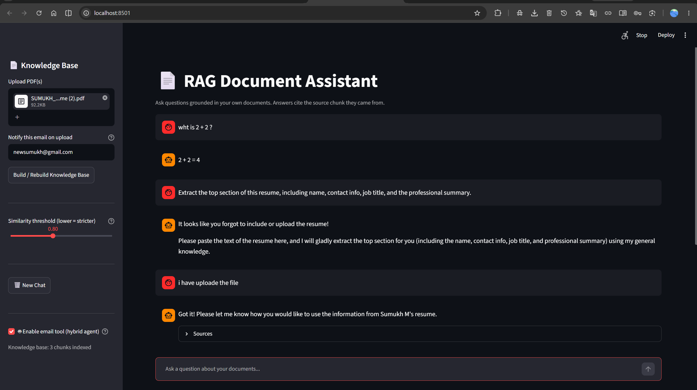
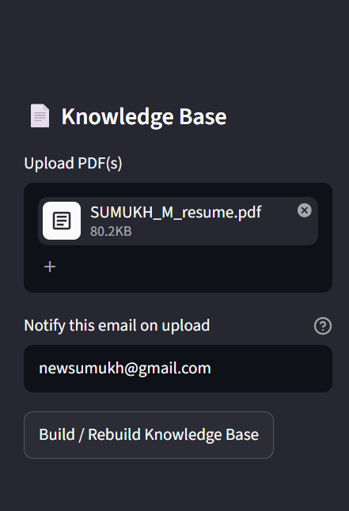
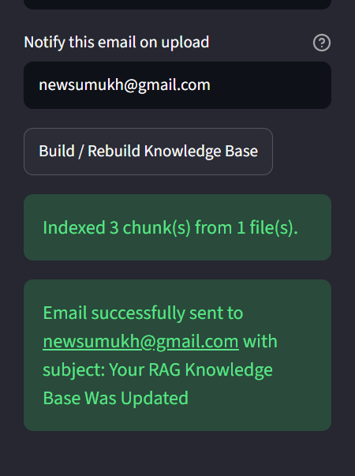
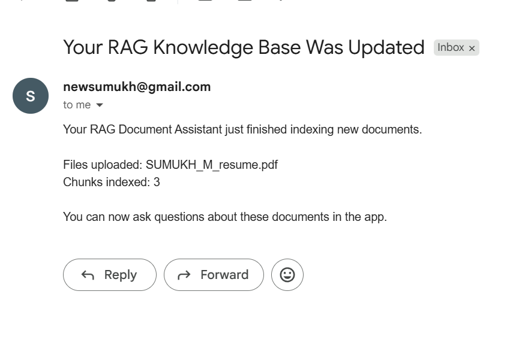
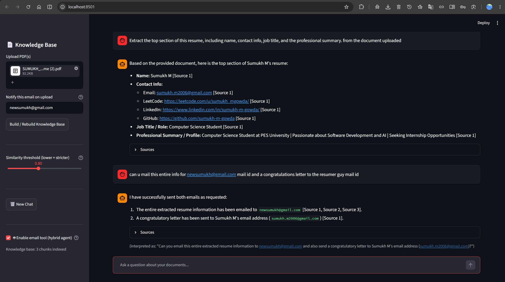
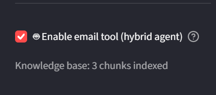
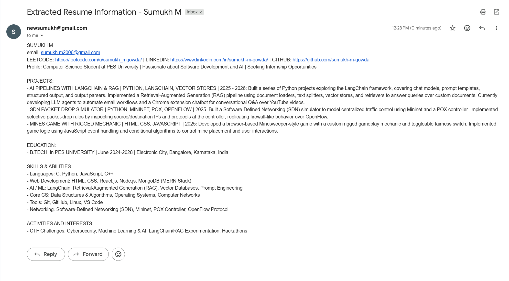
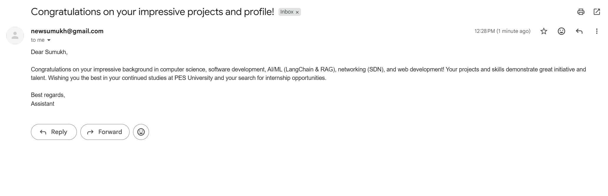

# RAG Document Assistant

<p align="center">
  
</p>

A production-style Retrieval-Augmented Generation (RAG) application built with **LangChain**, **Google Gemini**, **ChromaDB**, and **Streamlit**.

The assistant allows users to upload PDF documents, build a persistent vector database, ask questions grounded only in those documents, cite sources, maintain conversational memory, and even perform AI tool-calling to send emails directly from the chat.

---

# Features

- PDF Knowledge Base
- Gemini Embeddings
- Persistent ChromaDB
- Conversational Memory
- Source Citations
- Hybrid AI Agent
- Email Tool Calling
- Upload Notifications
- Modern Streamlit UI

---

# Tech Stack

| Category | Technology |
|-----------|------------|
| LLM | Google Gemini |
| Framework | LangChain |
| Vector Database | ChromaDB |
| Embeddings | Gemini Embedding Model |
| UI | Streamlit |
| Email | Gmail SMTP |
| Language | Python |

---

# Project Workflow

```
Upload PDFs
      │
      ▼
Extract Text
      │
      ▼
Chunk Documents
      │
      ▼
Generate Embeddings
      │
      ▼
Store inside ChromaDB
      │
      ▼
Ask Questions
      │
      ▼
Retrieve Relevant Chunks
      │
      ▼
Gemini Generates Grounded Answer
      │
      ▼
(Optional)
Use Email Tool
```

---

# Application Walkthrough

## 1. Upload PDFs & Build Knowledge Base

Upload one or multiple PDF documents.

Optionally provide an email address to receive a notification after indexing is completed.

<p align="center">

</p>

After clicking **Build / Rebuild Knowledge Base**, the application

- Saves the PDFs
- Extracts text
- Splits into chunks
- Creates embeddings
- Stores them inside ChromaDB

The sidebar displays indexing progress and confirms successful completion.

<p align="center">

</p>

---

## 2. Automatic Upload Notification

Once indexing finishes successfully, an email notification is automatically sent.

The email includes

- Uploaded files
- Number of indexed chunks
- Confirmation that the knowledge base is ready

<p align="center">

</p>

---

## 3. Ask Questions About Your Documents

After the knowledge base has been created, simply start chatting.

The assistant retrieves only the relevant document chunks before sending them to Gemini.

Answers include source citations.

<p align="center">

</p>

---

## 4. Hybrid Agent Mode

Enable the Hybrid Agent to unlock tool calling.

<p align="center">

</p>

When enabled, the assistant can:

- Continue answering document questions
- Use general knowledge if documents don't contain the answer
- Call external tools (Email) whenever explicitly requested

---

## 5. AI Tool Calling — Email Automation

Ask the assistant to email extracted information or generate personalized emails.

Example:

> Email this resume summary to me and send a congratulation letter to the candidate.

The assistant automatically:

- Extracts information from the RAG pipeline
- Calls the Email Tool
- Sends multiple emails
- Returns execution status

<p align="center">

</p>

---

## 6. Generated Emails

### Extracted Resume

The first email contains the structured information extracted from the uploaded resume.

<p align="center">

</p>

---

### Personalized Congratulations Letter

A second email is generated completely by the LLM and sent automatically.

<p align="center">

</p>

---

# RAG Pipeline

```
User Uploads PDFs
        │
        ▼
PyPDFLoader
        │
        ▼
RecursiveCharacterTextSplitter
        │
        ▼
Gemini Embeddings
        │
        ▼
ChromaDB
        │
        ▼
Similarity Search
        │
        ▼
Prompt Template
        │
        ▼
Gemini LLM
        │
        ▼
Answer + Source Citations
```

---

# Hybrid Agent Pipeline

```
User Request
      │
      ▼
Question Condensing
      │
      ▼
Retrieve Context
      │
      ▼
Gemini
      │
      ├───────────────► Normal RAG Answer
      │
      ▼
Need Email Tool?
      │
      ├── No ─────► Return Answer
      │
      └── Yes
             │
             ▼
        email_this Tool
             │
             ▼
        Gmail SMTP
             │
             ▼
      Final AI Response
```

---

# Installation

```bash
git clone https://github.com/yourusername/rag-document-assistant.git

cd rag-document-assistant

pip install -r requirements.txt
```

Create a `.env`

```env
GEMINI_API_KEY=YOUR_API_KEY

SENDER_EMAIL=YOUR_EMAIL

SENDER_APP_PASSWORD=YOUR_APP_PASSWORD
```

Run

```bash
streamlit run FINAL_APP.py
```

---

# Future Improvements

- Multiple vector databases
- OCR support
- Image understanding
- DOCX support
- Authentication
- Cloud deployment
- Chat export
- Conversation search
- Multi-user workspaces

---

# License

MIT License
